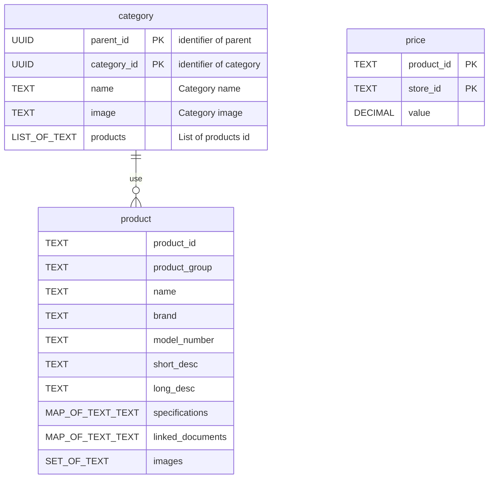

## Flow

```mermaid
graph TD;
    A-->B;
    A-->C;
    B-->D;
    C-->D;
```

## Er

```mermaid
erDiagram

category {
    UUID parent_id PK "identifier of parent"
    UUID category_id PK "identifier of category"
    TEXT name "Category name"
    TEXT image "Category image"
    LIST_OF_TEXT products "List of products id"
}

product {
    TEXT product_id
    TEXT product_group
    TEXT name
 TEXT brand
 TEXT model_number
 TEXT short_desc
 TEXT long_desc
 MAP_OF_TEXT_TEXT specifications
 MAP_OF_TEXT_TEXT linked_documents
 SET_OF_TEXT images
}

price {
    TEXT product_id PK
    TEXT store_id PK
    DECIMAL value
}


 category ||--o{ product : use

  
```
